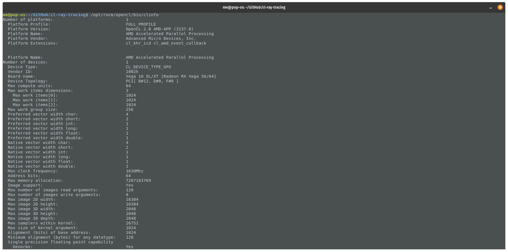

### Add the AMD repositories
Follow step 1 and 2 of the [official ROCm documentation](https://rocmdocs.amd.com/en/latest/Installation_Guide/Installation-Guide.html#supported-operating-systems).
### Install rocm-dev
```
sudo apt update
sudo apt install rocm-dev
```
### Add user to video and render group
```
sudo usermod -a -G video,render $LOGNAME && sudo reboot
```
### Verify if ROCm and OpenCL are working
```
/opt/rocm/bin/rocminfo
```

```
/opt/rocm/opencl/bin/clinfo

```

